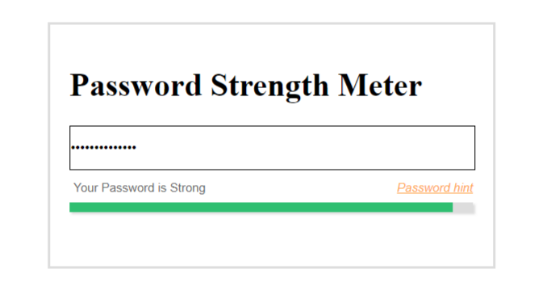
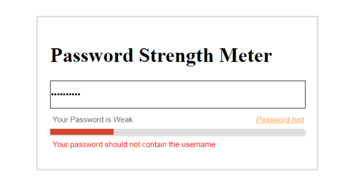
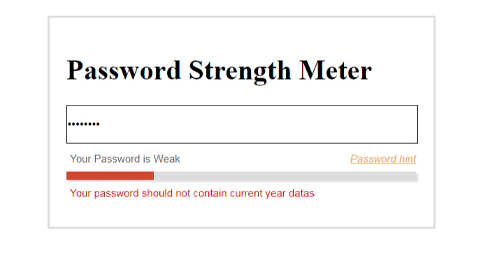
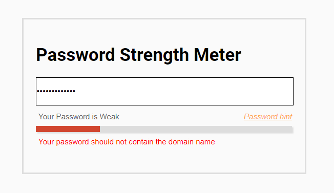

<h1>EDGE-Components-Hackathon-2019</h1>

<h3>Password Strength Meter</h3>
<p>This project is done using polymer3 and available as web component</p>

# \<pws-meter\>

Password strength meter

## Install the Polymer-CLI

First, make sure you have the [Polymer CLI](https://www.npmjs.com/package/polymer-cli) and npm (packaged with [Node.js](https://nodejs.org)) installed. Run `npm install` to install your element's dependencies, then run `polymer serve` to serve your element locally.

## Viewing Your Element

```
$ polymer serve
```

## Demo Url

<a href="https://stackblitz.com/edit/polymer-3-template-xmtjcc?file=custom-element.js">click to demo</a>

## How to use and options

---

    <pws-meter 
        username='dynamic username' 
        customsg='custom warning message'  
        strengthrange='basic/advanced' 
        infoicon='enable' 
        iconmessage='info message for setting the strong message'  
        mypassword="your input password here"
        rangewords="Short,Weak,Okay,Good,Strong"
        rangecolors="#D1462F,#D1462F,#57B8FF,#57B8FF,#2FBF71">
    </pws-meter>
---

## Sample screen shots
<h4>Empty screen</h4>

<h4>Basic Password option</h4>


---
Advance Password option
---
<h4>Avoid username in password</h4>


<h4>Avoid current year related datas in password</h4>


<h4>Avoid domain related datas in password</h4>


## Reference Urls:
<h4><a href="https://polymer-library.polymer-project.org/3.0/docs/about_30">https://polymer-library.polymer-project.org/3.0/docs/about_30</a></h4>
## Running Tests

```
$ polymer test
```

Your application is already set up to be tested via [web-component-tester](https://github.com/Polymer/web-component-tester). Run `polymer test` to run your application's test suite locally.
